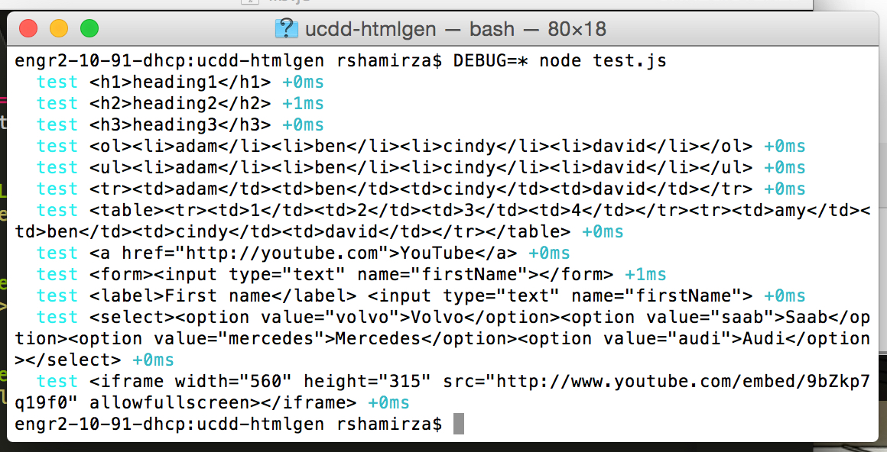
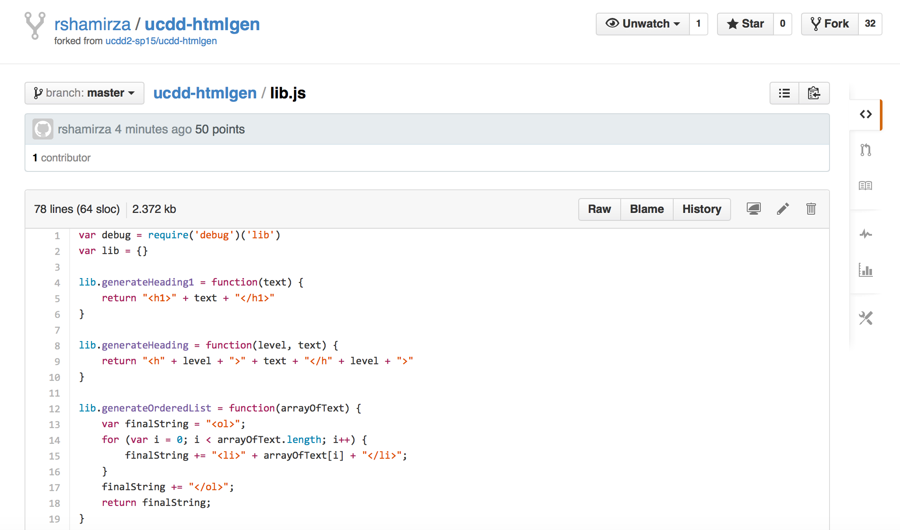
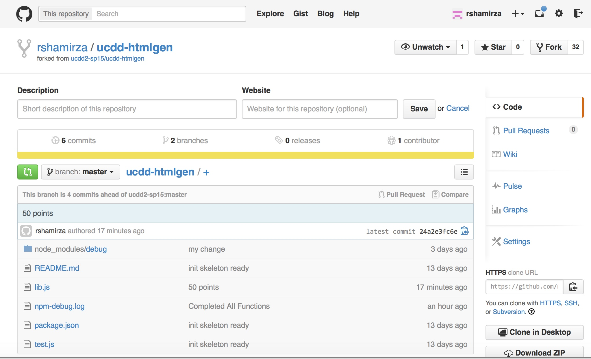
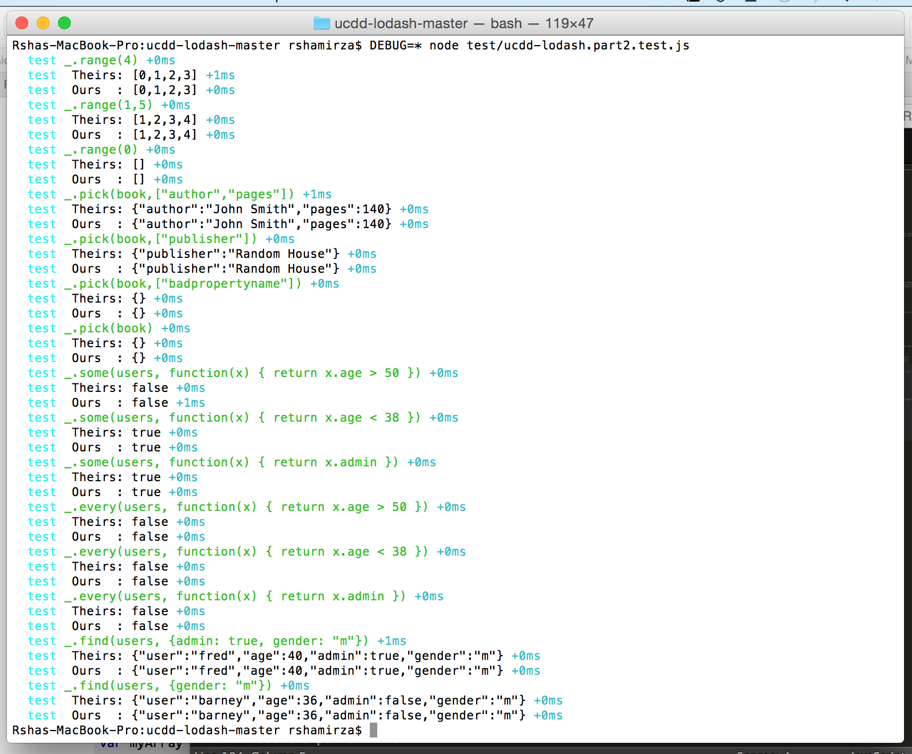

Rsha Mirza
==========

## Favorite Food

Steaks

Chocolates

## Favorite Programming Language

VB.Net

Lotus Notes

## Week 0 Milestones (50/50):

1- Have implemented ONE more function

2- Have committed and pushed this implementation to one’s own fork

## Week 1 Milestones (50/50):

1- Have implemented all functions in lib.js (40/40)

2- Have committed and pushed my implementation to my own fork (10/10)

## Week 2 Milestones (50/50):

1- Have implemented range (10/10)

2- Have implemented pick (10/10)

3- Have implemented some (10/10)

4- Have implemented every (10/10)

5- Have implemented find (10/10)

